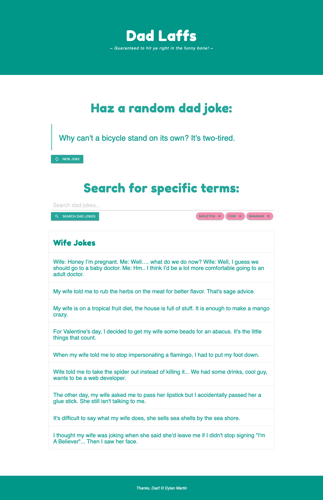

# Dad Laffs

## Description

Dad Laffs is a celebration of terrible dad jokes, but more importantly it is a landing page for searching dad jokes!

- I created this application as an example project for beginning developers wanting to learn more about APIs
- Check out the [icanhazdadjoke API documentation](https://icanhazdadjoke.com/api) for more information on endpoint used.
- Highly recommend testing your endpoints with [Postman](https://www.postman.com/) if you haven't before. Just make sure to set headers to 'Accept': 'application/json' when calling fetch()

----

## Project Links

- [Github Repo](https://github.com/therealdylanmartin/dad-joke-api)
- [Dad Laffs Live Webpage](https://therealdylanmartin.github.io/dad-joke-api/)

----

## Table of Contents (Optional)

If your README is long, add a table of contents to make it easy for users to find what they need.

- [Installation](#installation)
- [Usage](#usage)
- [Screenshot](#screenshot)
- [License](#license)
- [Features](#features)

----

## Installation

Run 'index.html' in your preferred browser.

----

## Usage

View randomly generated jokes or use the search input provided to filter specific terms.

----

## Screenshot

----

## License

Use this project however you like, just don't claim it as your own project!

----

## Features

- Page generates a random joke on page load.
- A button is provided to generate new random joke, replacing the one previously rendered.
- Input is provided to search dad joke database with specific terms, scrolling to rendered jokes upon successful retrieval.
- A global variable keeps track of terms searched in order to throw an error message upon duplicate searches.
- Search terms are added to local storage upon submission, rendering success message.
- Terms used from previous sessions are fetched from local storage and used to render quick-search buttons under search input.
- Pressing the 'X' on an individual search term button will remove it from local storage and render a success message.

----